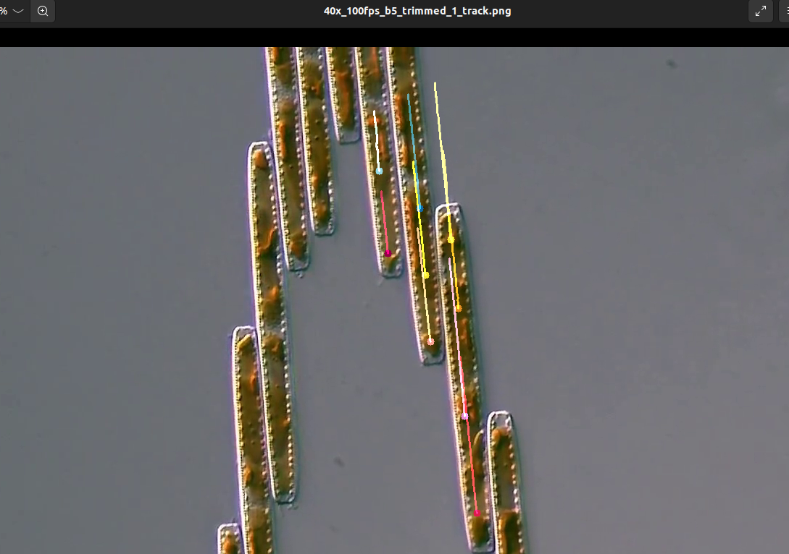

# Devlog

This is a development log for answering if Bacillaria has smooth movement or not using visual tracking.

## Local installation

The project was install locally using 
`
torch                   1.12.1+cu113
detectron2              0.6
`

These links were helpful - [Torch installation](https://detectron2.readthedocs.io/en/latest/tutorials/install.html) and [Pytorch local installation](https://pytorch.org/get-started/locally/)

## 2022-08-28

I've installed the requirements to activate the Object detection and instance segmentation. 

| Explanation                               | Image                                                        |
| ----------------------------------------- | ------------------------------------------------------------ |
|                                           |                                                              |
|                                           |                                                              |
| I've used the tool of tracking in a video |  |

## 2022-08-29

| Exp                                                          | Img                                                          |
| ------------------------------------------------------------ | ------------------------------------------------------------ |
| I'm trying to harris corner detec the spots                  |  |
| This is a zoom out of the spots . It's from the right side.  |  |
| Measuring the pixels it seems like it's around 5-9 pixles.   |                                                              |
| Also with changes of parameters the corners detection didn't seem good. |                                                              |
|                                                              |                                                              |

# 2022-09-04

I've tried the optical flow tracking and it seems to do a much better job. 

I've just taken the standard code from [opencv optical flow](https://docs.opencv.org/3.4/d4/dee/tutorial_optical_flow.html) page and it worked first time!

| Exp                                                          | Image                                                        |
| ------------------------------------------------------------ | ------------------------------------------------------------ |
| The diatoms from the tracking video                          |  |
| We can see straight lines of tracking points on the diatoms. |                                                              |
| I'll chat about it with devoworm panel.                      |                                                              |
| Code is in [script](Smooth-Movement/opt_flow_track.py)       |                                                              |

**2022-09-06**

<u>Meetup with Thomas and Dick and Bradly</u>

Stuff from my side - 

1. Show repository 
2. Activating the Segmentation notebook + results. 
3. Show algorithms - corner Harris detection + Optical flow algorithm. 

Project ideas from Dick Gordon - 

1. Determine if smooth or jerky 
2. Visualize cloud around a colony 
3. Long range interactions 
4. Light piping 
5. Wall of light - of a colony. Was checked for single cell.
6. Single cell - 
7. Ability to get out of sediment (mud) - 
8. Acceleration by light - 
9. Papers - 
   1. Sabuncu, A.C., Gordon, R., Richer, E., Manoylov, K.M. and Beskok, A. (2021) The kinematics of explosively jerky diatom motility: A natural example of active nanofluidics. In:  Diatom Gliding Motility [Volume in the series: Diatoms: Biology & Applications, series editors: Richard Gordon & Joseph Seckbach]. S.A. Cohn, K.M. Manoylov and R. Gordon, (eds.) Wiley-Scrivener, Beverly, MA, USA: 33-63. 
   2. Tiffany, M.A. & M. Ghobara (eds.) (2023) Chain Diatoms [DCHN, Volume in the series: Diatoms: Biology & Applications, series editors: Richard Gordon & Joseph Seckbach, Proposal: In preparation]. Wiley-Scrivener, Beverly, MA, USA.. 

Sharing of presentation by Thomas - 

1. We are ignoring movement in the axis along the stacking of the diatoms. IE we are checking jerky movement along the movement of the diatom.
2. The movement can be divided to a smooth part and a jerky part. On top of that we can add the external movement error (tracking error, camera error, etc...).
3. 

# 2022-09-19

Tracking 1 diatom. To reproduce the results from Thomas.

I want to track each diatom. 

I'll create a format of subfolders with - trimmed_video, initial coordinates of diatom to track.

| Exp                | Img                                                          |
| ------------------ | ------------------------------------------------------------ |
| Calibration phase. |  |
|                    |                                                              |
|                    |                                                              |

Chat with Bradly on 19th of Sept

| Exp                                                          | Img                                                          |
| ------------------------------------------------------------ | ------------------------------------------------------------ |
| Talking about the equations and about the noise and correlation between them |  |
|                                                              | [Link](https://jamboard.google.com/d/1YlKtX_YqosTLvHO8j6gvSWQ3rVQxp1z1YlQujrOfo14/viewer?f=0) |
|                                                              |                                                              |

**2022-10-09**

I want to track 1 diatom - steps:

1. ~~Get video,~~ 
2. ~~Get times in video~~
3. ~~Trim and save to new video~~
4. ~~Decide start point - manually~~
5. ~~Activate tracker on 1 point.~~ 
6. ~~Get tracking pixels~~
7. ~~Save to file~~
8. ~~Transform to micro meters~~
   1. ~~Get micro meter scale transformation.~~
9. ~~Rotate to 1 axis - transform to polar coordinates.~~
10. Duplicate to 2 spots on 1 diatom

**2022-10-10**

Calibrate the camera to smooth motion - stoke's law. 

Edge detection - and angle prediction. 

Assumption - all diatoms are parallel - Get a distribution of what the angles are. 

Line approach. NN training. Looking in the repo. If not then write doc for it and prepare it for people to use in the future. 

| Exp                                                          | Img                                                          |
| ------------------------------------------------------------ | ------------------------------------------------------------ |
| Showing the distribution of the line of tracking             |  |
| The tracking line                                            |  |
| We can see that there is a distribution, but maybe it's small? I can also get the mean and std just to be sure. |                                                              |
| STD                                                          |  |
|                                                              |  |
| This is the degrees because of y is increasing as we go down, so it's suppose to be -83 deg. |                                                              |
|                                                              |                                                              |

In degrees:

| Exp                                                          | Img                                                          |
| ------------------------------------------------------------ | ------------------------------------------------------------ |
|                                                              |  |
|                                                              |  |
| Now it fits more, I can see that the std is really low relative to the angle that is being formed. |                                                              |
|                                                              |                                                              |

# 2022-10-13

I'm duplicating the tracker to 2 points and more.

| Exp                                                          | Img                                                          |
| ------------------------------------------------------------ | ------------------------------------------------------------ |
| I've entered another point and the tracker is holding it fine. Without saving the points ATM |  |
| Adding points breaks when the number of points changes. Cause how would I know which point got removed... |  |
| But it works well for unbreaking tracking points.            |  |
|                                                              |                                                              |

# Devlog End
